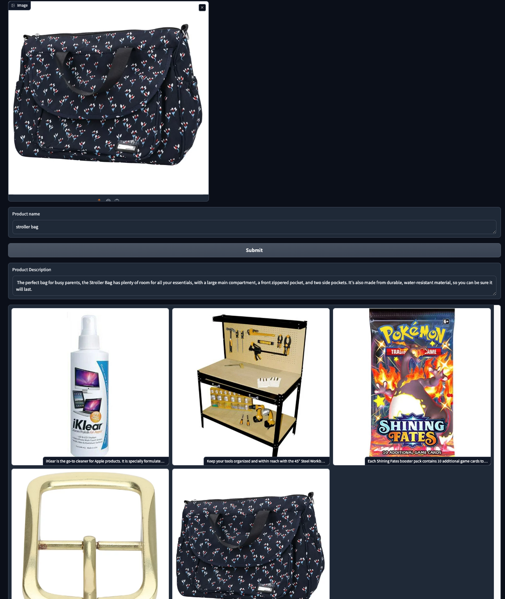

# README To be updated

## TL;DR
- ### Problem statement: 
  - With the rise of ecommerce the need to create 'salesy' descriptions to capture potential customers attention is crucial, multiply this by 1000's of sale items you can get the picture. Customers are asking for an inventory management solution where they can automate the above problem statement.  
- ### Solution: 
  - This cloud native app is a GenAI inventory management solution that upon startup will provision the cloud resources it needs to function.  Then all the customer has to do is upload a picture of their product and its name.  The application uses GenAI to write an attention grabbing 'salesy' description of the product, return that to the user, next it saves a copy of this image in a bucket with read only ACL for the public and updates a CloudSQL postgresql database with the product name, description, and public GCS url to a database.

### Back End
- This is a cloud native app written in Python, makes use of Object-Oriented Programming to separate logical functions and allow for extensibility
- GCS is used to store images uploaded by users
- CloudSQL PostGress is the database where the 'Products' table is stored which contains: a primary key, product name, product description and public gcs inventory image links
- Gemini model is used in multimodal mode with prompt engineering to return the desired formatted description output
- App is designed to be deployed on CloudRun ideally or GKE
- Calls to perform various operations such as database operations for example are wrapped in a "try except" block to catch any errors along with logging for visibility of the error.

### Operation
- Once the app is started the main.py will call the Initialization Class is called and it will:
  - Checks to see if a bucket (random_name) is present if not creates the bucket with the appropriate ACLs configured and returns gcs bucket link
  - Checks if a database table is already created if not creates database table and returns database engine object.  Engine object contains a pool of connections that mathods use to connect to the database.
  - Initializes Vertex client and returns Gemini client object
- Database class: 
  - Tests the connection to the database
  - Returns the database engine object if it can connect to the database
- DatabaseOperations class provide methods to:
  - list the tables in a database
  - Get the contents of a table
  - Insert rows into a table
  - Get only the description of a product
  - Truncate the table (delete all items in the table)
- Description class:
  - Composes the multipart prompt for the multimodal GenAI Model
  - Performs prompt engineering to get the model to provide the desired response 
  - returns the GenAI response to the caller
- Image_Ops class in gcs_operations.py provide methods to:
  - Save an image
  - Get an image public url
  - Get an image 

### Front End
- Uses Gradio.io to create the front end of this app
- Takes two inputs: image of inventory product and product name
- Returns two outputs: "salesy" description of the uploaded item and 
a gallery of all items in the database with their descriptions as caption
- Front End created using Gradio and Python
- Converts an array of lists of lists to a list of tuples
- Calls the backend to handles users requests